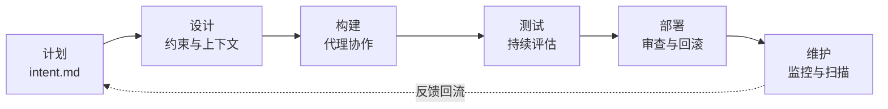

> 本文是对 Anthropic《[The AI-Native SDLC playbook](https://claude.com/blog/the-ai-native-sdlc-playbook)》的中文分享与提炼。原文页面标注发布日期为 2026 年 8 月 21 日、更新日期为 8 月 26 日。文中关于 Claude 产品和 Anthropic 团队实践的描述属于厂商自述，不等同于独立评测或普遍适用的工程结论。

## 代码变快之后，真正慢的是什么？

过去一年，代理式 AI 让“写代码”这件事明显提速。问题是，围绕代码的流程没有一起变快：需求还在等会议，设计还在等评审，安全检查还在排队，发布还要等下一个窗口。

这就是原文开篇想指出的反差：**当构建阶段从开发周期里塌缩出去，瓶颈就会转移到它的左边和右边。**计划、评审与测试、部署，仍然按人的速度运行。于是，团队可能得到更多代码，却没有得到更多可靠的软件。

原文没有提供跨组织的独立基准，不能据此断言“用了 Claude 就一定更快”。更准确的理解是：如果代理确实把代码产出推高，原来的人工闸门就可能变成新的排队点；SDLC 需要和实现阶段一样，重新设计。

## AI 原生 SDLC：不是自动化一段流程，而是把流程变成回路

传统 SDLC 像一条接力赛：计划交给设计，设计交给构建，构建交给测试，测试交给发布，最后由运维看着线上。每一棒都有文档、工单和签字，但交接往往是手工的，信息也会在交接中变形。

Anthropic 所说的 AI 原生 SDLC，更像一个持续运行的回路：AI 嵌入每个阶段，阶段之间自动交接；旧流程要求的控制目标继续保留，但控制方式改成版本化文件、自动检查、钩子和分层授权。原文也把它称为 agentic SDLC 或 AI SDLC，名称不同，指的是同一类变化。

最容易被忽略的是“承诺产物”。每个阶段结束时，都要把一个下阶段可读取的东西提交到版本控制：计划阶段可能是 `intent.md`，设计阶段是 `spec.md`，构建阶段是 `plan.md`、代码和测试，测试阶段是评估结果，部署阶段是 PR 及其审查记录，维护阶段则是事故记录或 lessons 文件。下一个阶段从这些提交开始，而不是从一段没有上下文的聊天开始。

这样一来，提交历史本身就成了审计轨迹：谁提出了什么，代理生成了什么，哪些检查通过了，谁批准了高风险动作。人的责任没有消失，只是人的注意力从“把每一行都看一遍”，转向目标、例外和需要判断的地方。

## 六个阶段，变化到底在哪里？

| 阶段 | 传统做法 | AI 原生做法（原文描述的方向） |
| --- | --- | --- |
| 计划 | 需求由会议、工作坊和签字逐层整理 | 从真实来源提炼痛点，写入人可读、机器可执行的 `intent.md` |
| 设计 | 分析师写规格，设计师再解释规格 | 与代理在一次工作会话中压缩需求和设计，规范以 skills 维护并进入 Git |
| 构建 | 代码、测试手写，文档常常事后补 | AI 生成代码和测试，团队知识写入版本化的 `CLAUDE.md` 与 skills |
| 测试 | 在阶段边界设置 QA 闸门 | 把持续评估（evals）织进实现过程，而不是最后才验收 |
| 部署 | 人工逐行审查，治理依赖周期性评审 | 代理分层审查；关键或受监管代码保留人工审查，hooks 作为批准闸门 |
| 维护 | 人盯着生产环境等问题出现 | 代理监控线上部署，越过控制带后诊断，并写回新的 `intent.md` |

这不是要求所有组织立刻跳到右侧。原文把两列当作光谱的两端，多数团队会处于中间位置。重要的是右侧贯穿始终的那条线：**每一阶段都留下可提交、可读取、可追踪的产物。**

## Plan：先写意图，再让代理行动

原文反复使用 `intent.md`，不是为了增加一个文档格式，而是为了让“为什么做这件事”进入后续自动化。一个可用的意图文件至少要说明问题或异常、证据、预期结果、受影响系统和仍未解决的问题。

它既能承载产品需求，也能承载监控异常和较大的安全发现。产品负责人和代理读的是同一份文件，后续的设计、实现和分诊不必重新猜测背景。

这里的人类工作不是替 AI 写得更详细，而是确认范围、约束和验收条件。意图不清楚时，自动化只会把模糊更快地放大。

## Design：把组织知识变成代理能读的约束

传统设计阶段常见的问题，是规范停留在某个人的经验里，或者写完就过期。AI 原生做法是把架构决策、接口契约、非功能要求和编码规范，放进代理能检索的项目上下文，并通过 Git 管理变更。

原文提到用 skills 编码标准，用 `CLAUDE.md` 保存团队知识。它们的意义不在于“给模型更多提示词”，而在于把隐性的组织规则变成可复用、可审查的资产。涉及数据、权限和合规的决定，仍由负责团队确认；代理只能在给定约束里提出方案。

## Build：从“生成代码”转向“生成可验证的变更”

Claude Code 在原文中扮演的不是自动提交机器人，而是能够读上下文、修改代码、生成测试、解释 diff、发起 PR 的协作者。真正的分界线在于：能写出来，不等于能合并。

构建阶段应该尽量让代理处理可拆分、可验证的工作；主干是否接受这次变更，则交给自动检查、分支保护和人工评审。代码越敏感，人的审查越应该靠近风险，而不是平均地把时间花在每一行上。

## Test：把质量从最后一道门，移到整个过程里

如果测试只在构建完成后才开始，代理越快，最后的排队越长。原文建议把持续评估（evals）织进实现过程，持续验证功能行为、回归风险和安全边界。

这并不意味着减少测试，而是改变测试的时机和对象：除了检查代码行，还要检查代理是否遵守项目规范、是否覆盖关键行为、是否在边界条件下给出可接受的结果。一次事故修复后补充对应评估用例，才能把一次性的经验变成下一次仍会运行的保护措施。

## Deploy：把治理做成代理行动时的约束

原文给出的方向是“分层代理审查”。低风险动作可以自动检查或只读诊断；涉及关键系统、受监管代码或生产变更时，保留人工批准。hooks、分支保护和预先批准的 runbook，负责把权限写成机器能执行的规则。

部署自动化不等于放弃审批。更现实的例子是：当异常超过既定控制带，代理可以打开一个 PR，或者调用已经批准的回滚流水线，但不能自己批准自己的修复。调用、诊断、批准和结果都进入带时间戳的记录。

## Maintain：让线上反馈重新进入计划

维护阶段是这套方法最有意思的地方。监控、事故和安全扫描不再是 SDLC 之外的“运维杂事”，而是能重新触发计划的输入。

### 持续监控循环

原文用 `bands.yaml` 展示分层响应：先由确定性的规则判断指标是否偏离基线，再决定 Claude 可以做什么。示例中，1σ 只记录，2σ 允许只读诊断，3σ 才能提出 PR 或调用预批准 runbook。这个阈值是示例，不应直接当成通用最佳实践。

关键原则是：检测保持确定性，模型只在规则触发后被调用；响应等级写入版本控制；权限系统阻止代理直接获得生产写权限。异常处理完成后，诊断和证据可以整理成新的 `intent.md`，重新回到计划阶段。

### 定期安全扫描

一次安全扫描只代表某个时间点，而且代码和模型都会变化。原文建议按项目设定扫描计划，给每条发现附上验证结果和置信度，驳回时留下原因。

范围明确的问题可以生成补丁并走 PR；跨服务的架构弱点则写成 `intent.md`，从计划阶段开始。模型驱动的扫描补充 CI 中的静态分析和依赖检查，而不是替代它们。

### 事故频道也是工作流的一部分

原文还描述了 Claude Tag 在 Slack 中参与值班的场景：事故消息出现在频道里，Claude 以自己的身份读取上下文、验证指标是否恢复、协助提出修复，并把复盘写入版本控制的 lessons 文件。

这里真正重要的不是“让机器人待在 Slack”，而是让请求、诊断、人的授权和修复结果留在同一个可回看的地方。小而明确的修复走 PR，较大的问题重新写成 `intent.md`。频道因此成为反馈链的一部分，而不是一个临时的黑盒。

## 治理的底线：人不退出，人的位置改变

AI 原生 SDLC 不是“让代理自己上线”，而是把人的判断放到更值得投入的地方：定义目标，确认边界，批准高风险动作，处理例外，复核结果。

一套可执行的边界至少包括：

- 代理默认只读，生产动作通过受限工具完成。
- 阈值、工具白名单、skills、hooks 和 runbook 全部版本化。
- 代理提出的变更不能由自己批准，必须经过 PR 和分支保护。
- 调用、诊断、驳回、批准和发布都有审计记录。
- 用交付周期、缺陷率、回滚率、安全发现处理时间和评审积压衡量结果，而不是只看生成了多少代码。

## 一个稳妥的落地顺序

先统一 `intent.md` 模板，把测试、监控和安全发现接入现有工单或 PR；再为代理设置只读权限和工具白名单；接着开放“提出变更”的能力；最后才考虑触发预批准 runbook。每扩大一层权限，就补上日志、评估和回滚方案。

这条顺序的好处是，团队可以先验证反馈链是否真的工作，再决定是否让代理承担更高风险的动作。没有审计和回退能力时，增加模型权限只是在放大未知风险。

## 原文精髓，可以压缩成三句话

第一，代码不再是唯一瓶颈，流程周围的人工速度会暴露出来。第二，AI 原生 SDLC 是一个由承诺产物连接起来的闭环，不是六个孤立的自动化工具。第三，人的判断不会被删除，而是从重复搬运转向目标、例外和责任。

Anthropic 这篇 playbook 的价值，不在于给出一张所有团队都能照抄的架构图，而在于提醒我们：当构建阶段变快，真正需要重做的是围绕代码的系统。先把反馈链跑通，再逐层扩大代理权限，可能比单纯追求更快的代码生成更接近“AI 原生”。

## 参考与证据边界

- 原文：[The AI-Native SDLC playbook](https://claude.com/blog/the-ai-native-sdlc-playbook)
- 原文中的产品和服务：Claude Code、Claude Security、Claude Tag，以及相关 CI/CD、hooks、skills 和 MCP 资源。
- 本文中的“原文描述”指 Anthropic 对自身实践和产品的公开叙述；“工程建议”是基于这些内容做的归纳，需要结合具体组织的风险、合规和系统约束验证。
